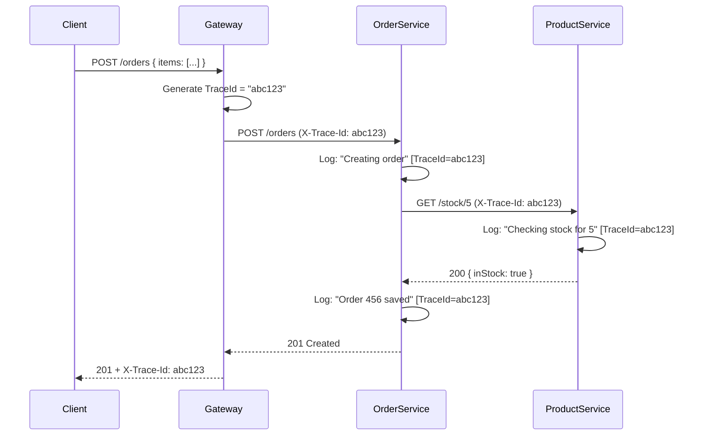

Here's a **detailed, syllabus-aligned guide on Serilog in .NET Core**, covering **Logging Essentials** from **Topic 2: Data Access, Caching & Logging**, enriched with:

✅ **Concepts & Best Practices**  
✅ **Mermaid diagrams** (architecture & flow)  
✅ **End-to-end example code** (setup, structured logging, sinks, correlation)  
✅ Mapping to **CO2**: *“Implement Dapper CRUD, caching, and structured logging”*

---

## 🔹 Why Serilog? (vs `ILogger<T>` default)

| Feature | Default `Microsoft.Extensions.Logging` | **Serilog** |
|--------|----------------------------------------|-------------|
| **Structured Logging** | ❌ Plain strings | ✅ `{Property}` placeholders → queryable logs |
| **Sinks (Outputs)** | Console, Debug, EventSource | ✅ **50+ sinks**: Seq, Elasticsearch, File, Azure, Datadog, etc. |
| **Enrichers** | Manual | ✅ Auto-add correlation ID, machine name, thread, etc. |
| **Configuration** | JSON or code | ✅ Code-first + config (appsettings) + runtime reload |
| **Performance** | Good | ✅ Optimized (asynchronous batching) |

> 🎯 **Syllabus alignment**: *"Logging Essentials"* → Serilog is the **industry standard** for enterprise .NET microservices (used at Microsoft, AWS SDKs, .NET Aspire dashboard).

---

## 🌐 Architecture Diagram: Serilog in a Microservice

```mermaid
flowchart LR
    A[Application Code] -->|Log.Information("Order {OrderId} created", id)| B[Serilog ILogger]
    B --> C[Enrichers]
    C -->|Add: TraceId, UserId, MachineName| D[Pipeline]
    D --> E[Sinks]
    
    subgraph Enrichers
        E1[WithProperty("TraceId")]
        E2[WithMachineName()]
        E3[WithThreadId()]
    end

    subgraph Sinks
        S1[Console]
        S2[File: logs/app-.log]
        S3[Seq (Local Dashboard)]
        S4[Azure Application Insights]
    end

    D --> S1
    D --> S2
    D --> S3
    D --> S4

    style A fill:#ffe58f
    style B fill:#b7eb8f
    style C fill:#ffd8bf
    style D fill:#d9d9d9
    style S3 fill:#69c0ff,stroke:#1890ff
```

> ✅ Logs flow: **Code → ILogger → Enrichment → Routing → Sinks**

---

## 🛠️ Step-by-Step Setup in .NET 8 (Minimal API)

### 1. Install NuGet Packages
```bash
dotnet add package Serilog.AspNetCore
dotnet add package Serilog.Sinks.Console
dotnet add package Serilog.Sinks.File
dotnet add package Serilog.Sinks.Seq          # Optional (recommended for labs)
dotnet add package Serilog.Enrichers.Environment
dotnet add package Serilog.Enrichers.Thread
```

> 💡 For labs: **Seq** (free for dev) gives a beautiful UI → https://datalust.co/seq

---

### 2. Configure Serilog in `Program.cs`

```csharp
using Serilog;

var builder = WebApplication.CreateBuilder(args);

// 🔴 STEP 1: Replace default logging with Serilog
Log.Logger = new LoggerConfiguration()
    .MinimumLevel.Information()
    .MinimumLevel.Override("Microsoft", LogEventLevel.Warning)
    .MinimumLevel.Override("System", LogEventLevel.Warning)
    
    // 🔵 Enrichers: Add contextual data
    .Enrich.FromLogContext()           // Allows .ForContext() & using (LogContext.PushProperty())
    .Enrich.WithMachineName()
    .Enrich.WithThreadId()
    .Enrich.WithEnvironmentName()
    
    // 🟢 Sinks: Where logs go
    .WriteTo.Console(
        outputTemplate: "[{Timestamp:HH:mm:ss} {Level:u3}] {Message:lj} {Properties:j}{NewLine}{Exception}")
    .WriteTo.File(
        "logs/app-.log",
        rollingInterval: RollingInterval.Day,
        retainedFileCountLimit: 7,
        outputTemplate: "{Timestamp:yyyy-MM-dd HH:mm:ss.fff zzz} [{Level:u3}] {Message:lj}{NewLine}{Exception}")
    .WriteTo.Seq("http://localhost:5341")   // Optional: local Seq server

    .CreateBootstrapLogger(); // Safe for early startup errors

builder.Host.UseSerilog(); // 🔴 STEP 2: Plug into Host

var app = builder.Build();
```

> ✅ **Note**: `.CreateBootstrapLogger()` captures errors during startup before full DI is ready.

---

## ✅ Structured Logging: Core Concept

### ❌ Traditional (Unstructured)
```csharp
_logger.LogInformation("User 123 placed order 456 for $78.90");
// → Hard to search: "Find all orders > $100"
```

### ✅ Serilog (Structured)
```csharp
_logger.LogInformation(
    "User {UserId} placed order {OrderId} for ${Amount:F2}",
    userId, orderId, amount);
```

### 🔍 Resulting JSON (in Seq/File):
```json
{
  "Timestamp": "2025-12-21T10:30:45Z",
  "Level": "Information",
  "MessageTemplate": "User {UserId} placed order {OrderId} for ${Amount:F2}",
  "Properties": {
    "UserId": 123,
    "OrderId": 456,
    "Amount": 78.90,
    "MachineName": "DESKTOP-ABC",
    "ThreadId": 14
  }
}
```

> 🎯 Now you can query:
> - `Amount > 100`
> - `UserId = 123`
> - `Has(OrderId)`

---

## 🔗 Correlation IDs (Essential for Microservices)

### Step 1: Middleware to Extract/Generate `TraceId`

```csharp
app.Use(async (context, next) =>
{
    var traceId = context.Request.Headers["X-Trace-Id"].FirstOrDefault()
                   ?? Guid.NewGuid().ToString("n");
    
    // 👇 Push to LogContext (available in all downstream logs)
    using (LogContext.PushProperty("TraceId", traceId))
    {
        // Optional: Add to response
        context.Response.Headers["X-Trace-Id"] = traceId;
        await next();
    }
});
```

### Step 2: Log with TraceId automatically
```csharp
app.MapGet("/orders/{id}", async (int id, IOrderService svc, ILogger<Program> logger) =>
{
    logger.LogInformation("Fetching order {OrderId}", id); // ✅ TraceId auto-attached!
    var order = await svc.GetOrderAsync(id);
    return Results.Ok(order);
});
```

### 🔎 In Seq:
| Message | TraceId | UserId |
|---------|---------|--------|
| `Fetching order 456` | `a1b2c3...` | — |
| `DB: SELECT * FROM Orders WHERE Id=456` | `a1b2c3...` | — |
| `Order returned` | `a1b2c3...` | — |

> ✅ End-to-end request tracing — critical for **CO2 (structured logging)**.

---

## 📊 Diagram: Logging Flow with Correlation ID



> ✅ Same `TraceId` flows across services — enables distributed tracing (foundation for OpenTelemetry later).

---

## 🧪 Logging with Dapper (Full CO2 Integration)

```csharp
public class ProductRepository : IProductRepository
{
    private readonly IDbConnection _connection;
    private readonly ILogger<ProductRepository> _logger;

    public ProductRepository(IDbConnection conn, ILogger<ProductRepository> logger)
    {
        _connection = conn;
        _logger = logger;
    }

    public async Task<Product?> GetByIdAsync(int id)
    {
        const string sql = "SELECT * FROM Products WHERE Id = @Id";
        
        _logger.LogDebug("Executing query: {Sql} with {@Params}", sql, new { Id = id });

        try
        {
            var product = await _connection.QuerySingleOrDefaultAsync<Product>(sql, new { Id = id });
            
            if (product == null)
                _logger.LogWarning("Product {ProductId} not found", id);
            else
                _logger.LogInformation("Product {ProductId} retrieved: {ProductName}", id, product.Name);

            return product;
        }
        catch (Exception ex)
        {
            _logger.LogError(ex, "Failed to fetch product {ProductId}", id);
            throw; // or handle gracefully
        }
    }
}
```

> ✅ Logs include:
> - SQL query (for debugging)  
> - Parameters (as structured object `@Params`)  
> - Success/failure context  
> - Exception + stack trace

---

## 📁 Recommended `appsettings.json` (Optional Config)

```json
{
  "Serilog": {
    "Using": [ "Serilog.Sinks.Console", "Serilog.Sinks.File" ],
    "MinimumLevel": {
      "Default": "Information",
      "Override": {
        "Microsoft": "Warning",
        "System": "Warning"
      }
    },
    "WriteTo": [
      { "Name": "Console" },
      {
        "Name": "File",
        "Args": {
          "path": "logs/app-.log",
          "rollingInterval": "Day",
          "retainedFileCountLimit": 7
        }
      }
    ],
    "Enrich": [ "FromLogContext", "WithMachineName", "WithThreadId" ]
  }
}
```

Then in `Program.cs`:
```csharp
builder.Host.UseSerilog((ctx, config) => 
    config.ReadFrom.Configuration(ctx.Configuration));
```

---

## 📈 CO–PO Mapping Support

| Outcome | How Serilog Helps |
|--------|-------------------|
| **CO2**: Implement structured logging | ✅ Structured properties, correlation IDs, sinks |
| **PO1 (Engineering Knowledge)** | Applies logging best practices in real systems |
| **PO3 (Problem Analysis)** | Enables log-based debugging & RCA |
| **PO5 (Modern Tool Usage)** | Industry tools (Seq, ELK, App Insights) |

---

## 🖼️ Quick Reference: Serilog Template Tokens

| Token | Example | Purpose |
|-------|---------|---------|
| `{Message}` | `"User logged in"` | Raw message |
| `{Message:lj}` | `"User logged in"` | **Literal JSON** (no quoting strings) |
| `{Properties}` | `{ "UserId": 123 }` | All structured props |
| `{Properties:j}` | `{"UserId":123}` | Compact JSON |
| `{Exception}` | Stack trace | Only if exception present |
| `{Timestamp}` | `2025-12-21 10:30:45` | ISO timestamp |

> Use `{Message:lj}` + `{Properties:j}` for machine-friendly logs.

---

