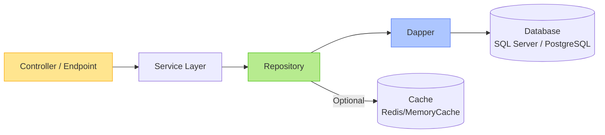
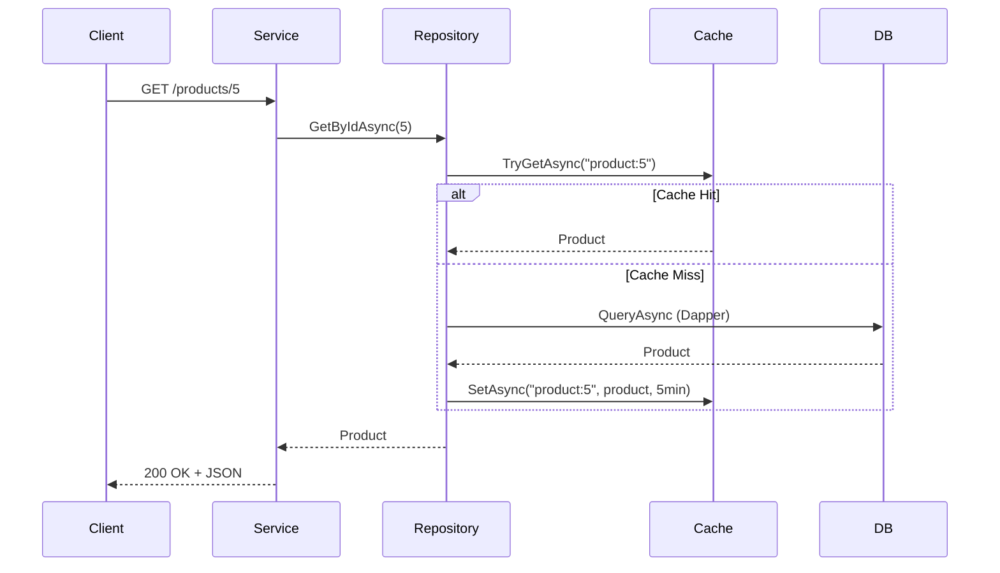

## 1. Data Access Fundamentals in .NET Core

### ✅ Key Concepts
| Concept | Description |
|--------|-------------|
| **Connection Management** | Use `IDbConnection` (e.g., `SqlConnection`) — always dispose or use `using`. Prefer `IHttpClientFactory`-like pattern via DI. |
| **Parameterized Queries** | Prevent SQL injection via `@param` placeholders. |
| **Synchronous vs Asynchronous** | Prefer `QueryAsync`, `ExecuteAsync` for I/O-bound ops. |
| **Microservice Data Isolation** | Each service owns its database (no cross-service joins). |
| **Raw SQL vs ORM** | Dapper = **micro-ORM**: fast, lightweight, full SQL control (vs EF Core’s abstraction). |

### 📊 Data Access Stack in .NET Microservice



> ✅ **Layer separation**: controllers depend on abstractions (interfaces), not concrete DB logic.

---

## 🔹 2. Dapper CRUD + Stored Procedures

### 🧰 Setup (DI Registration in `Program.cs`)
```csharp
builder.Services.AddSingleton<IDbConnection>(sp =>
    new SqlConnection(builder.Configuration.GetConnectionString("Default")));
```

> ⚠️ For production, use **connection pooling** + scoped lifetime (e.g., via `IDbConnectionFactory` or **Dapper.FastCrud** helpers).

---

### ✅ Basic CRUD with Dapper

#### 1. **Create (Insert)**  
```csharp
public async Task<int> CreateProduct(Product product)
{
    const string sql = @"
        INSERT INTO Products (Name, Price, CategoryId) 
        VALUES (@Name, @Price, @CategoryId);
        SELECT CAST(SCOPE_IDENTITY() AS INT);";

    return await _connection.QuerySingleAsync<int>(sql, product);
}
```

#### 2. **Read (Query)**
```csharp
public async Task<IEnumerable<Product>> GetProducts()
{
    const string sql = "SELECT * FROM Products WHERE IsActive = 1";
    return await _connection.QueryAsync<Product>(sql);
}

public async Task<Product?> GetProductById(int id)
{
    const string sql = "SELECT * FROM Products WHERE Id = @Id";
    return await _connection.QuerySingleOrDefaultAsync<Product>(sql, new { Id = id });
}
```

#### 3. **Update**
```csharp
public async Task<bool> UpdateProduct(Product product)
{
    const string sql = @"
        UPDATE Products 
        SET Name = @Name, Price = @Price, UpdatedAt = GETUTCDATE() 
        WHERE Id = @Id";

    var rows = await _connection.ExecuteAsync(sql, product);
    return rows > 0;
}
```

#### 4. **Delete**
```csharp
public async Task<bool> DeleteProduct(int id)
{
    const string sql = "DELETE FROM Products WHERE Id = @Id AND IsDeletable = 1";
    var rows = await _connection.ExecuteAsync(sql, new { Id = id });
    return rows > 0;
}
```

---

### 🔄 Stored Procedures with Dapper

#### Example: `usp_GetProductsWithCategory`
```sql
CREATE PROCEDURE usp_GetProductsWithCategory
    @CategoryId INT = NULL
AS
BEGIN
    SELECT p.*, c.Name AS CategoryName
    FROM Products p
    LEFT JOIN Categories c ON p.CategoryId = c.Id
    WHERE @CategoryId IS NULL OR p.CategoryId = @CategoryId;
END
```

#### Call from .NET:
```csharp
public async Task<IEnumerable<ProductWithCategory>> GetProductsWithCategory(int? categoryId = null)
{
    return await _connection.QueryAsync<ProductWithCategory>(
        "usp_GetProductsWithCategory",
        new { CategoryId = categoryId },
        commandType: CommandType.StoredProcedure
    );
}
```

> ✅ ✅ **Best Practice**: Always use `commandType: CommandType.StoredProcedure` — enables query plan caching in SQL Server.

---

## 🔹 3. Repository Pattern with Dapper

### 🎯 Why Repository?
- Abstract data access logic
- Enable unit testing (mock repos)
- Decouple business logic from persistence

### 📁 Structure
```
/Repositories
  ├── IProductRepository.cs
  └── ProductRepository.cs
/Models
  ├── Product.cs
  └── ProductWithCategory.cs
/Services
  └── ProductService.cs     // uses IProductRepository
```

---

### 📜 Interface (`IProductRepository.cs`)
```csharp
public interface IProductRepository
{
    Task<Product?> GetByIdAsync(int id);
    Task<IEnumerable<Product>> GetAllAsync();
    Task<int> AddAsync(Product product);
    Task<bool> UpdateAsync(Product product);
    Task<bool> DeleteAsync(int id);
    Task<IEnumerable<ProductWithCategory>> GetWithCategoriesAsync(int? categoryId);
}
```

---

### 📜 Implementation (`ProductRepository.cs`)
```csharp
public class ProductRepository : IProductRepository
{
    private readonly IDbConnection _connection;

    public ProductRepository(IDbConnection connection) 
        => _connection = connection;

    public async Task<Product?> GetByIdAsync(int id)
        => await _connection.QuerySingleOrDefaultAsync<Product>(
            "SELECT * FROM Products WHERE Id = @Id", 
            new { Id = id });

    // ... other methods (as shown above)
}
```

### 🔧 Register in DI (`Program.cs`)
```csharp
builder.Services.AddScoped<IProductRepository, ProductRepository>();
```

---
## 📊 Comparison: Dapper vs EF Core (for Microservices)

| Feature | Dapper | EF Core |
|--------|--------|---------|
| **Performance** | ⚡ Very high (near raw ADO.NET) | Good (with optimizations) |
| **Control** | Full SQL control | LINQ abstraction |
| **Migrations** | Manual or external (e.g., Flyway) | ✅ Built-in (`dotnet ef migrations`) |
| **Change Tracking** | ❌ Manual | ✅ Automatic |
| **Best For** | High-throughput services, complex queries, SP-heavy apps | Rapid dev, domain modeling, simple CRUD |

> 🎯 For this course (2501CS634), **Dapper is preferred** to emphasize performance, transparency, and control — aligning with enterprise microservice needs.

---

## 🖼️ Diagram: Repository + Dapper + Caching Integration (Preview for CO2)


