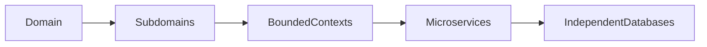
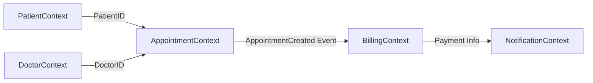
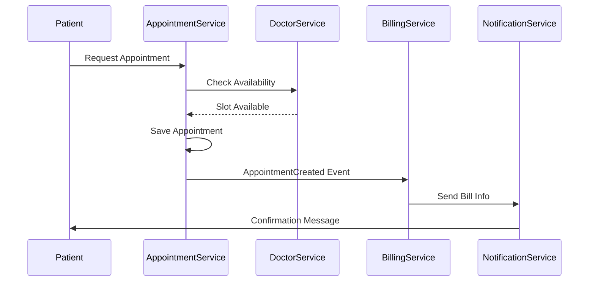
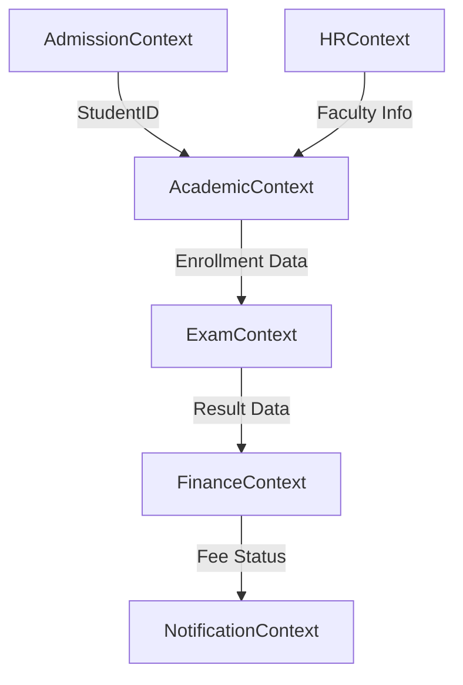

## 2501CS634 - Advanced .NET with Modern Architectures | Sem. - 6
# **Unit-1 | Fundamentals of Distributed Systems & Microservices**

## 🔹 Core Microservice Design Concepts

| Concept | Description | .NET Core Relevance |
|--------|-------------|---------------------|
| **Single Responsibility** | Each service should own a specific business capability and be independently deployable. | Encouraged via clean project structure (e.g., separate API projects per bounded context). |
| **Domain-Driven Design (DDD)** | Services are modeled around business domains using aggregates, entities, value objects, and bounded contexts. | Tools: MediatR, CQRS, AutoMapper help enforce DDD patterns. |
| **Decentralized Data Management** | Each microservice owns its private database (no shared DB). | Use Entity Framework Core/Dapper per service; avoid cross-service DB joins. |
| **Resilience & Fault Tolerance** | Services must handle failures gracefully (e.g., retries, circuit breakers). | Libraries: **Polly** for retry/backoff/circuit-breaking policies. |
| **Observability** | Logging, metrics, and tracing must be built-in. | Use **Serilog** + **OpenTelemetry** + **Seq/Grafana/Prometheus**. |
| **API Gateway Pattern** | Single entry point to route requests, handle auth, rate-limiting, etc. | Implement using **YARP (Yet Another Reverse Proxy)** or **Ocelot**. |
| **Service Discovery** | Dynamic location of service instances (esp. in containers/K8s). | **Consul**, **Eureka (via Steeltoe)**, or Kubernetes-native DNS. |

---

## 🔹 Microservice Architecture Components (in .NET Core Ecosystem)

| Component | Purpose | Typical .NET Core Tools/Libraries |
|----------|---------|-----------------------------------|
| **API Gateway** | Entry point, routing, composition, auth | YARP, Ocelot |
| **Service Registry** | Maintain list of available service instances | Consul, etcd, Steeltoe + Eureka |
| **Config Server** | Centralized config (e.g., per env) | Steeltoe Config Server (Spring Cloud Config integration) |
| **Message Broker** | Async communication (events, commands) | **RabbitMQ**, **Azure Service Bus**, **Kafka (.NET clients)** |
| **Distributed Tracing** | End-to-end request tracking | **OpenTelemetry** + Jaeger/Zipkin |
| **Health Checks** | Monitor service liveness/readiness | Built-in `Microsoft.Extensions.Diagnostics.HealthChecks` |
| **Circuit Breaker & Retry** | Prevent cascading failures | **Polly** |
| **Authentication/Authorization** | Secure inter-service & user access | **IdentityServer4 / Duende IdentityServer**, JWT Bearer auth |

> 🧩 Bonus: **.NET Aspire** (preview in .NET 8/9) simplifies building & orchestrating distributed apps (incl. service discovery, config, secrets, dashboard).

---

## 🔹 Communication Patterns in .NET Core Microservices

### 1. **Synchronous (Request–Response)**  
- Used for real-time interaction (e.g., UI → API).
- **Protocols**: HTTP/REST, gRPC.
- **Tools**:
  - **REST**: Minimal APIs, Controllers, `HttpClient` + `IHttpClientFactory`.
  - **gRPC**: High-performance, contract-first (`.proto`), ideal for internal service-to-service.
    ```csharp
    // Client factory injection
    services.AddGrpcClient<Greeter.GreeterClient>(o => o.Address = new Uri("https://greeter:5001"));
    ```

### 2. **Asynchronous (Event-Driven)**  
- Decouples services via messages/events.
- **Patterns**:
  - **Publish/Subscribe** (1→many): e.g., “OrderPlaced” event.
  - **Point-to-Point** (1→1): e.g., command “ProcessPayment”.
- **Tools**:
  - **RabbitMQ** with `RabbitMQ.Client` or `MassTransit` (recommended).
  - **Azure Service Bus** with `Azure.Messaging.ServiceBus`.
  ```csharp
  // MassTransit + RabbitMQ consumer
  services.AddMassTransit(x =>
  {
      x.AddConsumer<OrderPlacedConsumer>();
      x.UsingRabbitMq((ctx, cfg) => cfg.ConfigureEndpoints(ctx));
  });
  ```

### 3. **Hybrid Patterns**
| Pattern | Use Case | .NET Example |
|--------|----------|--------------|
| **Saga (Orchestration/Choreography)** | Long-running distributed transactions | Use events (choreography) or a Saga orchestrator (e.g., MassTransit sagas). |
| **CQRS** | Separate reads (queries) and writes (commands) | MediatR + separate query/command handlers per service. |
| **Event Sourcing** | Store state changes as event log (for audit/replay) | Use **EventStoreDB** or relational store + custom projection. |

---


# Domain-Driven Design (DDD) & Microservices

## 1. What is Domain-Driven Design (DDD)?

Domain-Driven Design (DDD) is a software design approach that focuses on **understanding the business domain first** and then designing the software based on that domain.

👉 Instead of thinking in terms of database tables or UI screens, DDD encourages developers to think in terms of **real-world business problems and processes**.

**Simple Definition (Exam Ready):**
*Domain-Driven Design is a design methodology that structures software around business domains and their rules.*

---

## 2. Why DDD is Required?

Modern software systems like Hospital Management Systems or University ERP are **large and complex**. Without DDD, systems become tightly coupled and hard to maintain.

### Problems without DDD:

* One large monolithic application
* Tight coupling between modules
* Difficult to scale and modify
* Business logic scattered across code

### Benefits of DDD:

* Clear separation of responsibilities
* Business-aligned architecture
* Easy conversion to microservices
* Independent development and deployment

**Conclusion:**
DDD reduces complexity and improves maintainability of large systems.

---

## 3. Core DDD Concepts

### (a) Domain

The overall business problem area.

* Example: Hospital Management System

### (b) Subdomain

A logical part of the domain.

* Patient Management
* Appointment Scheduling
* Billing

### (c) Bounded Context

A boundary within which a domain model has a **specific meaning**.

Example:

* Patient in Patient Context = Name, Email, DOB
* Patient in Appointment Context = PatientID only

### (d) Entity

An object with unique identity.

* PatientID, DoctorID, AppointmentID

### (e) Aggregate

A group of related entities treated as one unit.

* Appointment Aggregate

### (f) Ubiquitous Language

Common language shared by developers and business users.

* Book Appointment
* Cancel Appointment
* Generate Bill

---

## 4. Relationship Between DDD and Microservices

### 📊 Diagram: DDD to Microservices Mapping



**Explanation (Write below diagram):**
This diagram shows how a business domain is divided into subdomains, each subdomain forms a bounded context, and each bounded context is implemented as an independent microservice with its own database.

DDD is the **foundation** for designing microservices.

👉 Each **bounded context** is mapped to **one microservice**.

Benefits:

* Loose coupling
* High cohesion
* Independent databases
* Better scalability

Example:

* Patient Context → Patient Service
* Appointment Context → Appointment Service
* Billing Context → Billing Service

---

## 5. Real-Time Example: Hospital Management System

### 📊 Diagram: Context Map (Hospital System)



**Explanation (Write below diagram):**
This context map shows interaction between bounded contexts using IDs and domain events. No service directly accesses another service’s database.

### Domains and Bounded Contexts:

* Patient Context
* Doctor Context
* Appointment Context
* Billing Context

### Appointment Booking Flow:

### 📊 Diagram: Sequence Diagram – Appointment Booking



**Explanation (Write below diagram):**
This sequence diagram explains step-by-step flow of appointment booking across multiple microservices.

1. Patient books appointment
2. Doctor availability checked
3. Appointment saved
4. Bill generated
5. Notification sent

Each step belongs to a **separate bounded context** and communicates using APIs or events.

---

## 6. University ERP – DDD Mapping (Very Important)

### 📊 Diagram: University ERP – DDD Context Map



**Explanation (Write below diagram):**
This diagram shows how different University ERP bounded contexts interact using identifiers and events.

University ERP is a real-life example where DDD is essential.

### Domains in University ERP:

* Admissions
* Academics
* Examination
* Finance
* HR & Payroll

### Bounded Context Mapping:

* Admission Context → Admission Service
* Academic Context → Academic Service
* Exam Context → Examination Service
* Finance Context → Fee & Payment Service
* HR Context → HR & Payroll Service

👉 Each service owns its **own database** and communicates using **IDs only**.

---

## 7. Key Exam Points to Remember

* DDD focuses on **business, not technology**
* Bounded Context defines clear boundaries
* Same term can have different meanings in different contexts
* Microservices are the implementation result of DDD
* No direct database sharing between services
---

